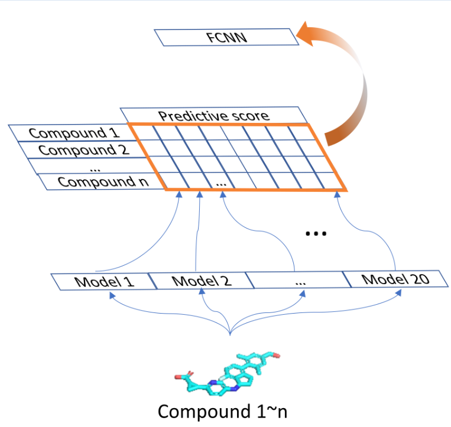
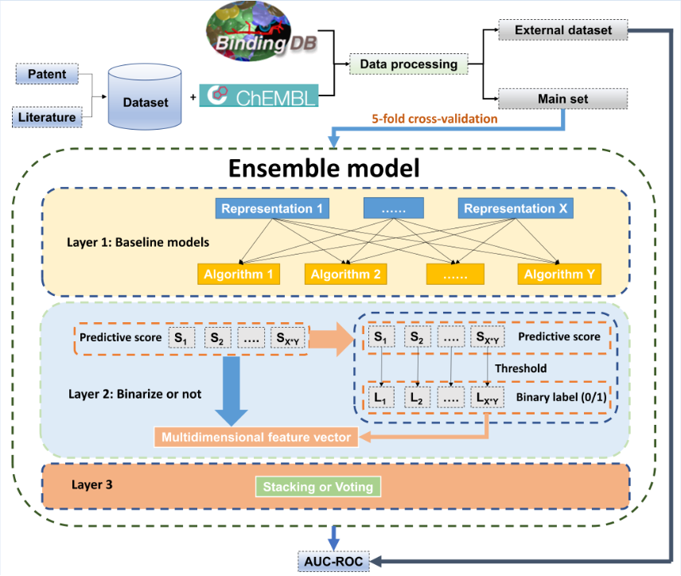

# Predicting GPR40 Agonists with A Deep Learning-Based Ensemble Model
this repository describes the calculation steps and optimization process of an ensemble model, as well as various results and related intermediate files.

Table of Contents:

1. Ensemble model architecture
2. Calculation and analysis of the model
3. Optimization of the Ensemble Model
4. Introduce of different folders and files

## Ensemble model architecture

## Calculation and analysis of the model
note: We used chemprop to partition the main dataset and then performed training and evaluation of the model. We also utilized an external dataset for additional evaluation of the model's performance.

### Script: **1_baseline_models_chemprop1.4.0.ipynb** (build baseline models and get predictive score of compounds in main set)

### Script: **2_baselines_load_pred_ext_sim.ipynb** (load models and predict the probability of compounds in different external datasets)

### Script: **3_anal_baseline_models.ipynb** (analysis the results of baseline model such as ROC AUC, and average the performance values of the model over five calculations)

### Script: **3b_anal_group_mdels_all_metric.ipynb** (caculate the performance values in all metric)

## Optimization of the Ensemble Model

### Script: **4_ensemble.ipynb** (build ensemble model and optimize the ensmeble model)

### Script: **5_anal_ensemble.ipynb** (evaluate the ensmeble)

### Script: **6_check_compare_chiral_FP.ipynb** (explore the impact of chiral fingerprints on the models)

### Script: **7_search_fcnn_param.ipynb** (explore the impact of different parameters in FCNN on the ensemble model)

## Introduce of different folders

folders：

1. **rand_{fearue}** ：the split main set (including compound SMILES, feature, label)  
(feature= , AtomPairFP, Autocorr, AvalonFP, Charge, Connectivity, Constitution, Estate, EstateFP, Fragment, InfoContent, Kappa, MACCSFP, MAP4, Matrix, MHFP6, MOE, MorganFP, Path, PharmacoErGFP, PharmacoPFP, Property, PubChemFP, RDkitFP, Topology, TorsionFP)

2. **xgb, svm, log, DMPNN, rf and fcnn** (the predictive probability of different models)

3. **esb, esb_01, voting** (the evaluation results of different ensmeble models: change number of nodes in FCNN (esb/esb.csv) and number of baseline models (esb_topN.csv), binarize or not in layer 2 (esb_01/esb_topN.csv), stacking or voting (vot_topN.csv), evaluate the model performance using different external datasets (esb_rmSim.csv) )

4. **fp** (the molecular representations of compounds in main set and external dataset)  
 **fp2** (the molecular representations of compounds in different external datasets)

5. **grouped_esb_metric** (the performance values of ensmeble model using different metrics)  
**grouped_metric** (the performance values of baseline models using different metrics)

6. **fcnn_AtomPairFP_search_param1, fcnn_AtomPairFP_search_param2_2layer** (parameter optimization of FCNN)

7. # Predicting GPR40 Agonists with A Deep Learning-Based Ensemble Model
this repository describes the calculation steps and optimization process of an ensemble model, as well as various results and related intermediate files.

Table of Contents:

1. Ensemble model architecture
2. Calculation and analysis of the model
3. Optimization of the Ensemble Model
4. Introduce of different folders

## Ensemble model architecture
png

## Calculation and analysis of the model
note: We used chemprop to partition the main dataset and then performed training and evaluation of the model. We also utilized an external dataset for additional evaluation of the model's performance.

### Script: **1_baseline_models_chemprop1.4.0.ipynb** (build baseline models and get predictive score of compounds in main set)

### Script: **2_baselines_load_pred_ext_sim.ipynb** (load models and predict the probability of compounds in different external datasets)

### Script: **3_anal_baseline_models.ipynb** (analysis the results of baseline model such as ROC AUC, and average the performance values of the model over five calculations)

### Script: **3b_anal_group_mdels_all_metric.ipynb** (caculate the performance values in all metric)

## Optimization of the Ensemble Model

### Script: **4_ensemble.ipynb** (build ensemble model and optimize the ensmeble model)

### Script: **5_anal_ensemble.ipynb** (evaluate the ensmeble)

### Script: **6_check_compare_chiral_FP.ipynb** (explore the impact of chiral fingerprints on the models)

### Script: **7_search_fcnn_param.ipynb** (explore the impact of different parameters in FCNN on the ensemble model)

## Introduce of different folders

folders：

1. **rand_{fearue}** ：the split main set (including compound SMILES, feature, label)  
(feature= , AtomPairFP, Autocorr, AvalonFP, Charge, Connectivity, Constitution, Estate, EstateFP, Fragment, InfoContent, Kappa, MACCSFP, MAP4, Matrix, MHFP6, MOE, MorganFP, Path, PharmacoErGFP, PharmacoPFP, Property, PubChemFP, RDkitFP, Topology, TorsionFP)

2. **xgb, svm, log, DMPNN, rf and fcnn** (the predictive probability of different models)

3. **esb, esb_01, voting** (the evaluation results of different ensmeble models: change number of nodes in FCNN (esb/esb.csv) and number of baseline models (esb_topN.csv), binarize or not in layer 2 (esb_01/esb_topN.csv), stacking or voting (vot_topN.csv), evaluate the model performance using different external datasets (esb_rmSim.csv) )

4. **fp** (the molecular representations of compounds in main set and external dataset)  
 **fp2** (the molecular representations of compounds in different external datasets)

5. **grouped_esb_metric** (the performance values of ensmeble model using different metrics)  
**grouped_metric** (the performance values of baseline models using different metrics)

6. **fcnn_AtomPairFP_search_param1, fcnn_AtomPairFP_search_param2_2layer** (parameter optimization of FCNN)

7. **Ext.csv, Ext_rm_sim_0_7.csv, Ext_rm_sim_0_8.csv, Ext_rm_sim_0_7.csv** (different external dataset with different numbers of compounds)  
**Main.csv** (compound SMILES and label of main set)

8. **eva_Morgan_chiral.csv** (perfomance of different ensemble models using chiral fingprints)

9. **eva_with_rmSim_hyper.csv, eva_with_rmSim_hyper_2layer.csv** (performance of different ensemble models using different parameter FCNN)

10. **eva_with_rmSim.csv** (evaluation of baseline models with different external dataset)  
**eva_ensemble_with_rmSim.csv** (evaluation of ensemble models with different external dataset)

